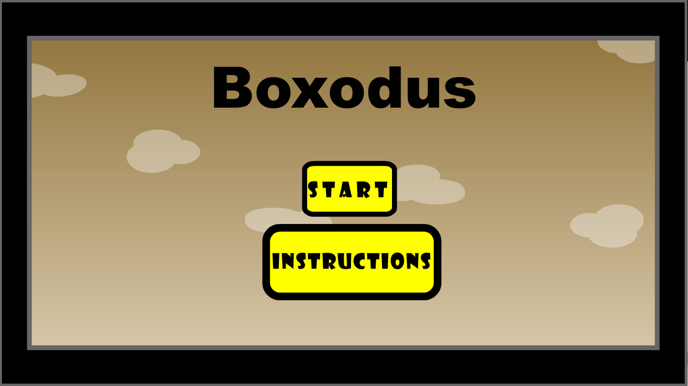
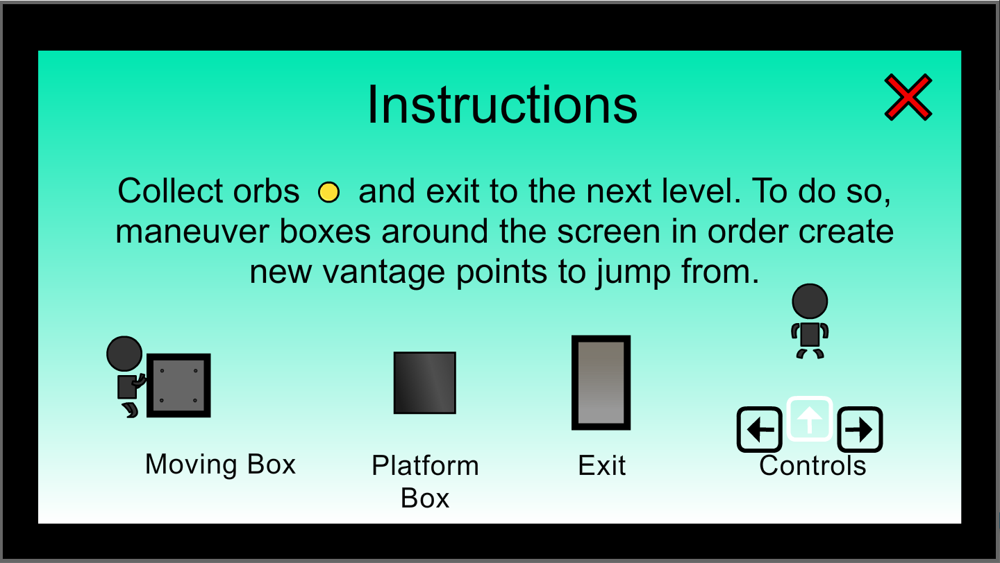
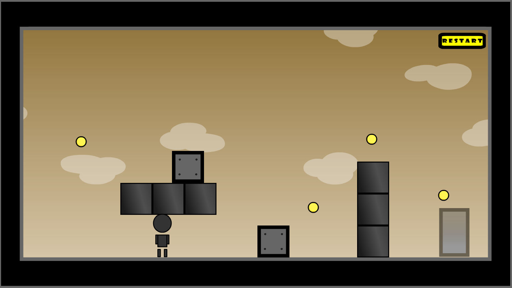
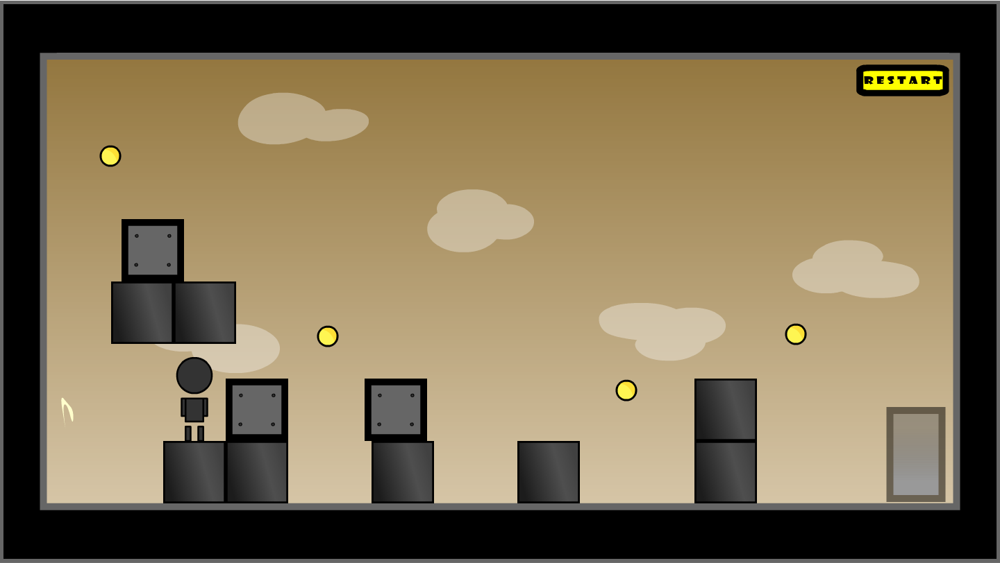
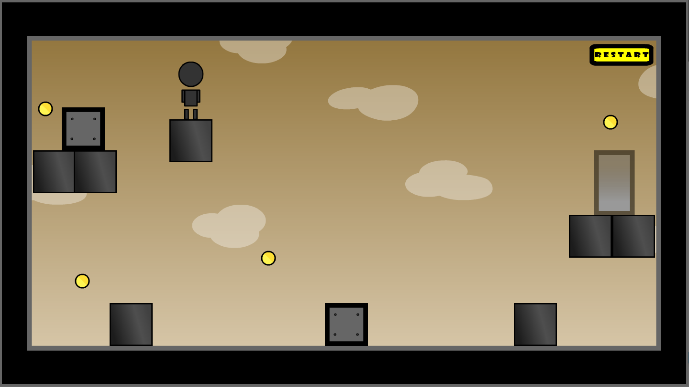
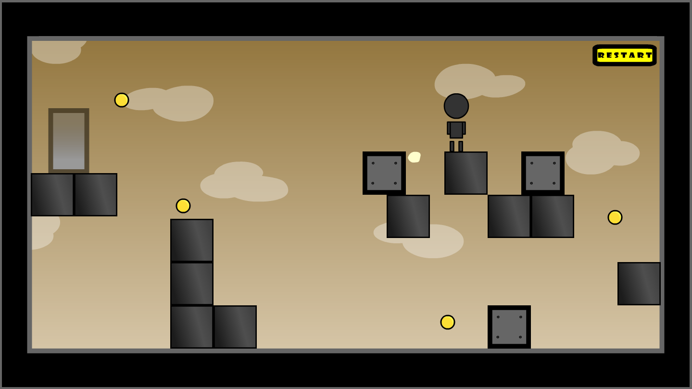
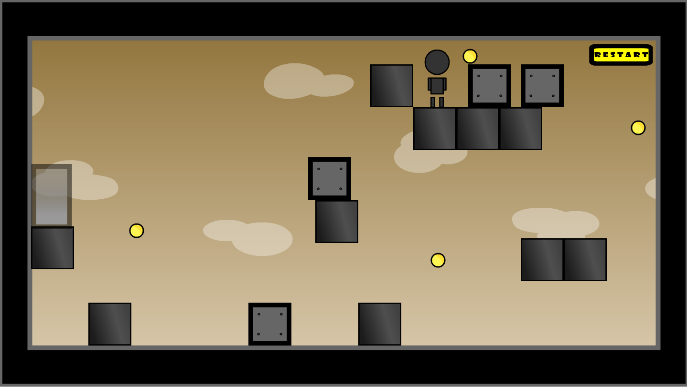
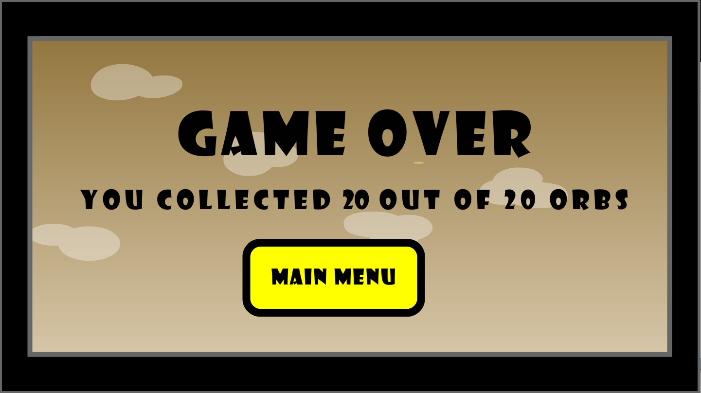

# Boxodus
A platformer game created using ActionScript 3.0 and Adobe Flash. 

### Setup

To play this on your browser, click [here](bit.ly/boxodus) (you will need to enable Flash).

If you wish to play the game from your local PC do the following:

Download version2_5.fla to get source code file.

To open this file you will need to download [Adobe Animate CC](https://www.adobe.com/ca/products/animate.html)

**Note: You can get a 7 day trial to test the game out but will need to purchase a membership after that.**

When you have the file opened on Adobe Animate CC press `Ctrl+Shift+Enter`

This should open the swf file allowing you to play the game!

### Game Interface

#### 1. Main Menu

#### 2. Instructions

#### 3. Levels

###### Level 1

###### Level 2

###### Level 3

###### Level 4

###### Level 5

#### 4. Game Over

